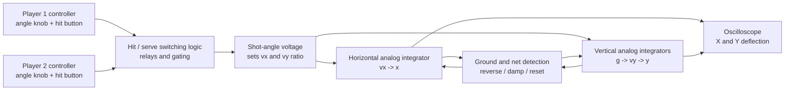
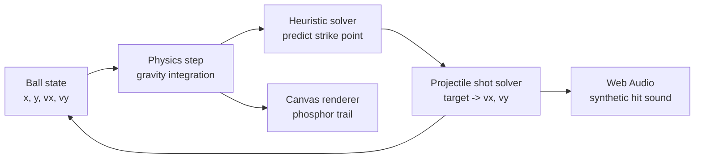

# Tennis for Two

An oscilloscope-style browser remake of **Tennis for Two**, built with plain HTML, CSS, JavaScript, Canvas, Web Audio, and a small heuristic physics solver.

Live demo: https://billzi2016.github.io/tennis-for-two/

Chinese README: [README.zh-CN.md](README.zh-CN.md)


## About The Original Game

**Tennis for Two** was created in 1958 by physicist William Higinbotham at Brookhaven National Laboratory. It is often remembered as one of the earliest interactive electronic games. Instead of a television or raster display, the original used an oscilloscope. The screen showed a side-view tennis court: a horizontal ground line, a vertical net, and a glowing moving point representing the ball.

The original appeal came from a simple physical idea. The ball did not just slide across the screen. It followed a projectile arc under gravity. Players adjusted the timing and angle of their shots, and the display made the motion feel immediate and physical. That combination of a laboratory instrument, a simple sports metaphor, and real-time interaction is what makes Tennis for Two still interesting today.

This project is not an exact hardware emulator. It is a browser reinterpretation of the same idea: a minimalist tennis court, glowing phosphor-like traces, projectile motion, and a system that can keep itself alive through automatic play.

## Original Hardware Principle

The 1958 machine was built around a **Donner Model 30 analog computer** and an oscilloscope. The important idea is that an analog computer does not step through instructions like a modern CPU. Instead, it represents mathematical variables as voltages and wires together analog computing blocks so the electrical behavior follows the same form as the physical equation being modeled.

For Tennis for Two, the physical system was a side-view projectile:

```text
x(t): horizontal ball position
y(t): vertical ball position
vx: horizontal velocity
vy: vertical velocity
g: gravity
```

In an analog computer, an integrator can turn acceleration into velocity, and velocity into position. Gravity is a constant acceleration fed into the vertical channel. The resulting X and Y voltages are sent to the oscilloscope deflection inputs, so the beam position on the screen becomes the ball position.

At a system level, the original setup can be understood like this:



The controllers were simple but effective. Each player had a knob and a button. The knob selected a shot angle, which was converted into an electrical setting for the new velocity components. Pressing the button told the game to apply that shot when the ball was in range. The original design considered more control, such as shot velocity, but that would have made the interface harder for visitors to use.

The court was also an electrical drawing problem. The oscilloscope beam received horizontal and vertical deflection signals. The game circuitry produced the moving ball signal, while additional display circuitry produced the court baseline and net. The result was not a pixel framebuffer; it was closer to drawing with voltages.

The collision behavior was handled with analog and switching logic. When the simulated ball reached the ground, the vertical velocity was reversed and reduced. When the ball failed to clear the net, the motion was interrupted or redirected. Much of the original machine used vacuum tubes and relays, while parts of the display circuitry used transistors. The later Brookhaven recreations replaced some period hardware with solid-state analog components, but the underlying idea remained the same: solve the motion as voltages and display those voltages on an oscilloscope.

This browser version translates that signal path into software:



The JavaScript implementation is therefore not a circuit simulation, but its structure mirrors the original instrument logic: state variables, integration, switching decisions, and a glowing display driven by computed coordinates.

## What This Version Does

This version opens directly in the browser and shows two AI players rallying against each other indefinitely. The page is designed to feel like a working oscilloscope demonstration surrounded by mathematical notes, signal-processing formulas, electromagnetic-field equations, Smith charts, and model-training loss functions.

The game itself stays intentionally minimal:

- one horizontal court line
- one vertical net line
- a glowing ball
- two glowing strike indicators
- phosphor-style trails
- synthesized hit sound
- autonomous AI rallying
- static GitHub Pages deployment

The visual language is closer to a lab instrument than a modern sports game. The ball leaves a fading trail because the canvas is not fully cleared each frame. The renderer paints a translucent dark layer over the previous frame, so older positions gradually decay like phosphor persistence.

## Local Run

Because the JavaScript uses ES modules, open the project through the included local server instead of double-clicking `index.html`.

```bash
python3 server.py
```

Then open:

```text
http://127.0.0.1:6324/
```

The hit sound is generated in the browser with Web Audio. Some browsers block audio until the first click or key press. The code attempts to start sound on page load, then falls back to unlocking audio on the first user interaction.

## Project Structure

```text
.
├── index.html
├── server.py
├── css/
│   ├── base.css
│   ├── hud.css
│   └── scope.css
├── data/
│   └── formulas.json
├── demo/
│   ├── Snipaste_2026-07-07_03-36-55.png
│   └── Snipaste_2026-07-07_03-37-35.png
└── js/
    ├── ai.js
    ├── audio.js
    ├── background-formulas.js
    ├── config.js
    ├── game.js
    ├── physics.js
    └── renderer.js
```

## How The Simulation Works

The ball is represented by position and velocity:

```text
x, y, vx, vy
```

Each animation frame advances the ball with a basic projectile update:

```text
vy = vy + gravity * dt
x  = x + vx * dt
y  = y + vy * dt
```

The court is deliberately simple. There are no textured surfaces or complex collision meshes. The net is a vertical line. If the ball collides with it, the velocity is damped and reflected. If the rally fails, the ball is reset for another serve.

The interesting part is the automatic rally system.

## The Heuristic AI Solver

The two players are not trained with reinforcement learning. They use a deterministic physical heuristic.

Every frame, each AI player looks at the current ball state and simulates a short future trajectory. The AI scans that predicted path for a point that satisfies several conditions:

- the ball is moving toward that player
- the predicted point is on that player's side
- the point is inside the player's reachable strike region
- the ball has flown long enough that the rally does not become instant center-line firing
- emergency late hits are still allowed if the ball is about to become unreachable

The selected strike point is not simply the first possible point. Candidate points are scored. Deeper and later points are preferred, so the ball travels farther into each side before being returned. This gives the rally more shape and avoids the feeling that both players are shooting directly across the middle.

When the player is ready to hit, the AI chooses a target on the opponent's side. The target is selected from several lanes:

- deep returns
- safer mid-court returns
- side-to-side variation
- shorter returns

The AI records its previous target and penalizes repeated target locations. That keeps the rally from becoming visually identical on every shot.

Once a target is selected, the solver computes the launch velocity needed to follow a projectile arc from the current strike point to the target in a chosen flight time:

```text
vx = delta_x / T
vy = (delta_y - 1/2 g T^2) / T
```

The candidate shot is accepted only if it:

- travels in the correct direction
- clears the net
- stays within a reasonable speed range
- lands in a playable region

If no ideal shot is found, the AI falls back to a conservative lob.

## Rendering

Rendering is handled by `js/renderer.js`. The canvas is fixed at a 16:9 internal resolution and then scaled by CSS.

The oscilloscope look comes from a few simple decisions:

- black-green display palette
- glowing strokes through canvas shadows
- additive drawing with `globalCompositeOperation = "lighter"`
- partial frame fade instead of a full clear
- simple geometric court lines
- no raster grid inside the screen

The screen itself is intentionally clean. The mathematical background and Smith chart decorations live outside the canvas layer so they do not interfere with the game display.

## Background Formula Layer

The background formulas are stored in `data/formulas.json`. They include equations from mechanics, thermodynamics, electromagnetic fields, DSP, image quality metrics, VAE objectives, diffusion models, flow matching, and Schrodinger bridge formulations.

`js/background-formulas.js` loads the JSON file and lays out a formula cloud behind the oscilloscope. The script uses multiple visual layers with different font sizes, opacity ranges, and spacing constraints. It also avoids the central oscilloscope area, so the formulas remain part of the surrounding environment rather than covering the playable screen.

The Smith chart decoration is generated as SVG by the same script. It draws a denser network of resistance circles, reactance arcs, outer boundary, and axis lines. The result stays lightweight because it is vector-based and generated once on page load.

## Instrument And Circuit Language

The original Tennis for Two was not a software window on a rectangular consumer display. It was shown on an oscilloscope, which is normally used to inspect changing electrical signals. That matters for the visual direction of this version. The screen is treated as an instrument face: dark, sparse, glowing, and built around traces rather than sprites.

This project does not attempt to reproduce the original analog circuit. There is no transistor-level model, no vacuum-tube model, and no simulation of the exact Brookhaven hardware. Instead, it borrows the language of laboratory electronics:

- the game screen is a clean oscilloscope-like display
- the ball behaves like a luminous trace with persistence
- the court is drawn as a signal-like line drawing
- the surrounding background looks like engineering scratch work
- the formulas and Smith charts suggest RF, fields, waves, impedance, and signal analysis

The Smith chart is included because it is one of the most recognizable diagrams in RF and transmission-line work. It is used for impedance matching and reflection-coefficient reasoning, not for the tennis physics itself. In this page, it acts as a visual bridge between an oscilloscope game and the broader world of electrical measurement. The generated chart includes the outer unit circle, real axis, constant-resistance circles, constant-reactance arcs, and extra minor circles so it feels like a real working chart rather than two decorative rings.

The formula layer follows the same idea. Maxwell equations, boundary conditions, DSP transforms, losses, VAE objectives, diffusion equations, flow matching, and Schrodinger bridge formulas are not all needed to move the ball. They form the surrounding notebook: the kind of dense technical context that makes the central oscilloscope feel like part of a larger experimental bench.

The implementation keeps those responsibilities separated:

- `data/formulas.json` is the formula pool
- `js/background-formulas.js` turns that pool into a controlled formula cloud
- the same script generates the Smith chart SVG
- `css/base.css` defines the background color, handwriting-style formula type, and chart styling
- `js/renderer.js` only draws the actual game screen

That separation is important. The oscilloscope screen should remain playable and readable. The engineering material belongs around it, not inside it.

## Audio

No audio files are used. The hit sound is synthesized with Web Audio:

- a short square-wave oscillator sweep
- a tiny burst of generated noise
- fast gain envelopes

This keeps the project self-contained and avoids asset licensing issues.

## Deployment

The project is a static site. It can be hosted with GitHub Pages from the repository root.

Expected Pages URL:

```text
https://billzi2016.github.io/tennis-for-two/
```

No build step is required.
