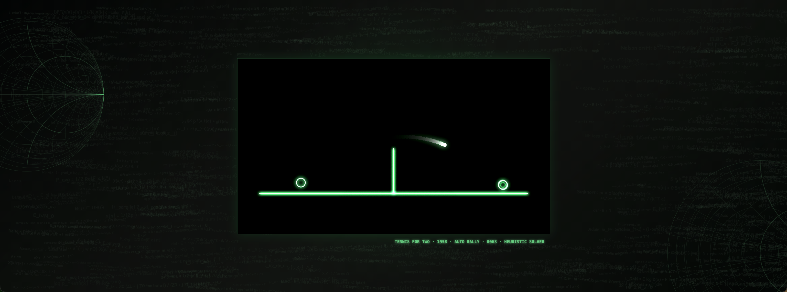
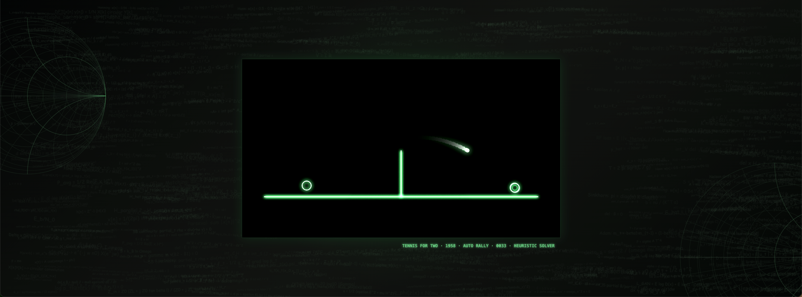
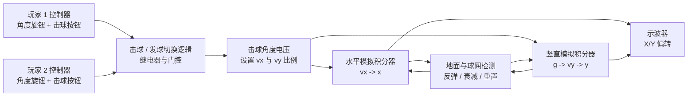
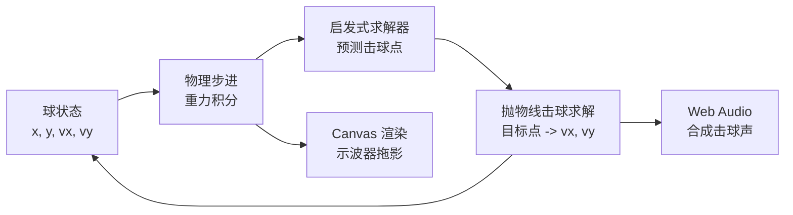

# Tennis for Two

这是一个示波器风格的 **Tennis for Two** 浏览器复刻版，使用原生 HTML、CSS、JavaScript、Canvas、Web Audio 和一个启发式物理求解器实现。

在线演示： https://billzi2016.github.io/tennis-for-two/

English README: [README.md](README.md)





## 原作背景

**Tennis for Two** 由物理学家 William Higinbotham 于 1958 年在 Brookhaven National Laboratory 制作。它经常被视为早期互动电子游戏中的重要作品之一。原作并不是显示在电视或现代显示器上，而是显示在示波器上。屏幕里只有一个侧视球场：一条水平地面线、一条竖直球网线，以及一个代表网球的发光点。

这个游戏真正有意思的地方，是它把一个很简单的运动模型变成了可以互动的视觉体验。球不是平移过去，而是在重力作用下沿抛物线飞行。玩家通过时机和角度来击球，示波器上的光点会留下短暂的视觉残留，让运动看起来像真实的物理轨迹。

这个项目不是对原始硬件的逐电路仿真，而是用浏览器重新表达同一个核心想法：极简球场、发光轨迹、抛体运动，以及可以自己持续运行的自动对战系统。

## 原作硬件原理

1958 年的 Tennis for Two 使用的是 **Donner Model 30 模拟计算机** 和示波器。这里的关键点是：模拟计算机不像现代 CPU 那样执行一条条指令，而是用电压表示数学变量，再把积分器、求和器、开关逻辑等模拟计算模块接起来，让电路本身的变化形式对应要模拟的物理方程。

对于 Tennis for Two 来说，被模拟的是侧视角下的抛体运动：

```text
x(t): 球的水平位置
y(t): 球的竖直位置
vx: 水平速度
vy: 竖直速度
g: 重力加速度
```

在模拟计算机里，积分器可以把加速度积分成速度，再把速度积分成位置。重力是竖直方向上的常量加速度，被送入竖直通道。最终得到的 X 和 Y 电压送到示波器的水平/竖直偏转输入，于是示波器上的光点位置就变成了球的位置。

从系统层面看，原作大致可以理解成下面这种信号流：



控制器本身很简单，但设计得很有效。每个玩家有一个旋钮和一个按钮。旋钮选择击球角度，这个角度会转成电路里的电压设置，用来决定新的水平速度和竖直速度比例。按钮用于触发击球。原作曾考虑加入更多控制量，比如击球速度，但那会让开放日参观者更难上手，所以最后保留了更直接的操作方式。

球场本身也是一个“用电压画图”的问题。示波器的光束位置由水平和竖直偏转电压决定。游戏电路产生运动中的球信号，显示电路再产生地面线和球网线。它不是像现代屏幕那样往像素缓冲区里写图像，而是更接近用连续电压控制光点在屏幕上画线。

碰撞和边界行为由模拟计算和开关逻辑共同处理。球到达地面时，竖直速度会反向并衰减；球没有足够高度越过球网时，运动会被中断或改变。原机大量使用真空管和继电器，显示相关电路中也使用了当时正在进入电子工业的晶体管。后来的 Brookhaven 复原版本有些使用固态运放替代了旧硬件，但核心思想没有变：用电压解运动方程，再把电压送到示波器显示。

这个浏览器版本把这条信号链翻译成了软件：



所以这个项目不是原作电路的逐元件仿真，但结构上保留了那种仪器逻辑：状态变量、积分、开关判断，以及由计算坐标驱动的发光显示。

## 这个版本做了什么

打开页面后，你会看到两个 AI 玩家自动对打。页面整体像一个工作中的示波器演示，外面包围着大学物理、数字信号处理、电磁场、Smith 圆图、VAE、扩散模型、Flow Matching 和 Schrodinger Bridge 等公式背景。

游戏主体保持极简：

- 一条水平球场线
- 一条竖直球网线
- 一个发光球
- 两个发光击球器
- 示波器拖影
- 合成击球音效
- 双 AI 自动对战
- 可以直接部署到 GitHub Pages

视觉上更接近实验室仪器，而不是现代体育游戏。Canvas 每一帧不会完全清空，而是覆盖一层半透明黑色，所以旧轨迹会慢慢衰减，看起来像示波器荧光屏上的余辉。

## 本地运行

因为项目使用了 ES modules，不建议直接双击 `index.html`。请使用自带的本地服务器：

```bash
python3 server.py
```

然后打开：

```text
http://127.0.0.1:6324/
```

击球声音由 Web Audio 实时合成。有些浏览器会阻止未交互的自动播放声音，所以代码会先尝试页面加载后直接启动音频；如果被浏览器拦截，点击页面或按任意键后声音会解锁。

## 项目结构

```text
.
├── index.html
├── server.py
├── css/
│   ├── base.css
│   ├── hud.css
│   └── scope.css
├── data/
│   └── formulas.json
├── demo/
│   ├── Snipaste_2026-07-07_03-36-55.png
│   └── Snipaste_2026-07-07_03-37-35.png
└── js/
    ├── ai.js
    ├── audio.js
    ├── background-formulas.js
    ├── config.js
    ├── game.js
    ├── physics.js
    └── renderer.js
```

## 物理模拟

球的状态由位置和速度组成：

```text
x, y, vx, vy
```

每一帧根据时间步长推进：

```text
vy = vy + gravity * dt
x  = x + vx * dt
y  = y + vy * dt
```

球场没有复杂碰撞体。网是一条竖线，地面是一条横线。球撞网时速度会被反弹和衰减。如果回合失败，系统会自动重新发球。

这个项目真正主要的部分，是自动对战的物理启发式 AI。

## AI 如何自动对打

这里没有训练神经网络，也没有强化学习。两个 AI 使用的是直接基于物理预测的启发式求解。

每一帧，AI 会读取球的当前位置和速度，然后向未来模拟一小段轨迹。它会在预测轨迹里寻找合适的击球点。一个点要满足：

- 球正在朝这个 AI 的方向飞
- 预测点在己方半场
- 预测点在可击球范围内
- 球已经飞行了一段时间，避免两边在中线互相瞬间对射
- 如果球快要落地，会允许保底击球，避免轻易断回合

AI 不是看到第一个能击球的点就立刻打，而是会给候选点评分。更深、更晚、离底线更近的点会优先被选择，这样球会在半场里多飞一会，回合节奏更自然。

击球时，AI 会从对方半场选一个目标点。目标不是固定的，而是在多个线路中选择：

- 深区回球
- 中场保守回球
- 左右变化
- 稍短的回球

AI 会记录上一次的目标点，如果下一次目标太接近，就会扣分。这样球路不会一直重复同一个位置。

确定目标点之后，求解器会反推出一组初速度，让球在指定飞行时间内从击球点飞到目标点：

```text
vx = delta_x / T
vy = (delta_y - 1/2 g T^2) / T
```

一个候选击球只有在满足这些条件时才会被接受：

- 方向正确
- 能越过球网
- 速度在合理范围内
- 落点在可继续对打的区域

如果没有找到理想解，AI 会使用一个更保守的高弧线回球。

## Canvas 渲染

渲染逻辑在 `js/renderer.js` 里。Canvas 使用固定 16:9 内部分辨率，再通过 CSS 缩放。

示波器风格主要来自这些处理：

- 黑绿配色
- Canvas 阴影制造发光线条
- `globalCompositeOperation = "lighter"` 做叠加发光
- 每帧半透明覆盖，而不是完全清屏
- 只保留极简球场线条
- 屏幕内部不放网格和公式

公式背景和 Smith 圆图在 Canvas 外层，所以不会干扰示波器屏幕里的游戏主体。

## 背景公式和 Smith 圆图

背景公式存放在 `data/formulas.json`。里面包含力学、热学、电磁场、DSP、图像质量指标、VAE、扩散模型、Flow Matching 和 Schrodinger Bridge 等公式。

`js/background-formulas.js` 会读取这个 JSON，然后自动生成公式云。公式云不是在 HTML 里硬编码，而是由脚本根据公式池生成。脚本使用多层布局，不同层有不同字号、透明度和间距限制，并且会避开中间的示波器屏幕区域。

Smith 圆图也是脚本生成的 SVG。它包含外圆、实轴、等电阻圆和等电抗弧，比简单背景圆圈更接近真实的 Smith chart 视觉结构。

## 仪器感和电路语言

原版 Tennis for Two 不是运行在现代矩形显示器上的软件窗口，而是显示在示波器上。示波器本来是用来观察电信号变化的仪器，所以这个背景很重要。这个版本的视觉方向不是做成现代小游戏，而是把屏幕当成一台仪器的显示面：黑底、稀疏、发光、强调轨迹。

这个项目没有模拟原作的真实模拟电路。这里没有晶体管级别的模型，也没有电子管模型，更没有复现 Brookhaven 当年那套硬件的完整电路。它借用的是实验室电子仪器的视觉语言：

- 游戏屏幕像一个干净的示波器显示面
- 球像带余辉的发光轨迹
- 球场线条像信号线一样被绘制出来
- 屏幕外背景像工程草稿纸
- 公式和 Smith 圆图让页面带有射频、场、波、阻抗和信号分析的氛围

Smith 圆图放在这里，不是因为网球运动本身需要它，而是因为它是射频和传输线领域里非常有辨识度的图。它常用于阻抗匹配和反射系数分析。这个页面里，它把“示波器游戏”和“电测量环境”连接起来。脚本生成的圆图包含外单位圆、实轴、等电阻圆、等电抗弧以及更多细分线，不只是两个装饰圆圈。

公式背景也是同样的思路。Maxwell 方程、边界条件、DSP 变换、loss、VAE、扩散模型、Flow Matching 和 Schrodinger Bridge 并不是都参与球的运动计算。它们更像放在仪器旁边的工程笔记，让中间的示波器屏幕像是一个更大实验台的一部分。

实现上这些部分是分开的：

- `data/formulas.json` 保存公式池
- `js/background-formulas.js` 把公式池生成受控分布的公式云
- 同一个脚本生成 Smith 圆图 SVG
- `css/base.css` 定义背景颜色、手写风格公式字体和圆图样式
- `js/renderer.js` 只负责绘制真正的游戏屏幕

这样拆分是有必要的。示波器屏幕内部要保持干净、可读、可玩；工程公式和圆图应该围绕它，而不是盖到游戏画面里面。

## 音效

项目没有使用任何外部音频文件。击球声音由 Web Audio 合成：

- 短促方波扫频
- 少量噪声
- 快速音量包络

这样项目可以保持自包含，也避免音频素材版权问题。

## 部署

这是一个纯静态页面，可以直接用 GitHub Pages 从仓库根目录部署。

预期 Pages 链接：

```text
https://billzi2016.github.io/tennis-for-two/
```

不需要构建步骤。
